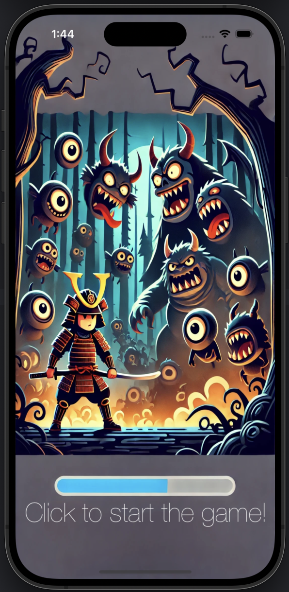
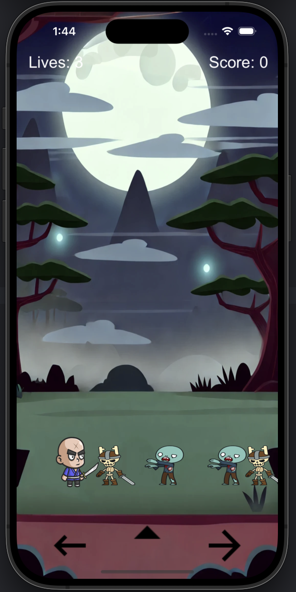
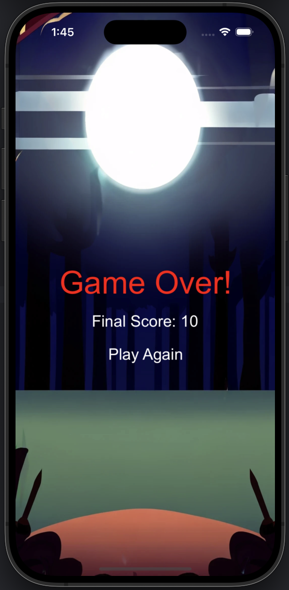

# SamuraiLastStand

Welcome to **SamuraiLastStand** – a 2D action game where you embody a brave samurai standing against relentless waves of enemies! 

## 🕹️ Gameplay Overview
In **SamuraiLastStand**, your task is to survive as long as possible while defending yourself from hordes of zombies and skeletons: master quick reflexes, strategic jumps, and powerful attacks to stay alive. 

- **Defeat Enemies:** Collect points for every enemy you defeat.
- **Manage Lives:** You start with 3 lives, and each time an enemy reaches you, you lose one.
- **Reach High Scores:** Survive longer and defeat more enemies to increase your score.

## 🎮 Features
- **Zombies & Skeletons:** Face two types of enemies, each with unique behaviors.
- **Jumping Mechanism:** Use the jump feature to dodge enemies or escape tight situations.
- **Game Over Screen:** A polished end-game screen showing your final score and a 'Play Again' button to jump right back into action.

## 💻 Game Screenshots

### 1. First Screen - The battle begins!


### 2. Second Screen - Facing the horde!


### 3. Game Over Screen - Your final score


## 🔧 How to Play
1. **Move:** Use the left and right buttons to move the samurai across the screen.
2. **Jump:** Press the jump button to leap and dodge enemies.
3. **Attack:** Tap on zombies or skeletons to defeat them before they reach you.
4. **Survive:** Manage your lives and aim for the highest possible score before losing all your lives!

## 🚀 Getting Started
To get started with **SamuraiLastStand**, clone the repository and run the project on your preferred platform (iOS). Ensure you have SpriteKit installed as the game uses it for animation and gameplay mechanics.

```bash
git clone https://github.com/cmontilha/SamuraiLastStand.git
```

## 📄 License

This project is licensed under the MIT License.

